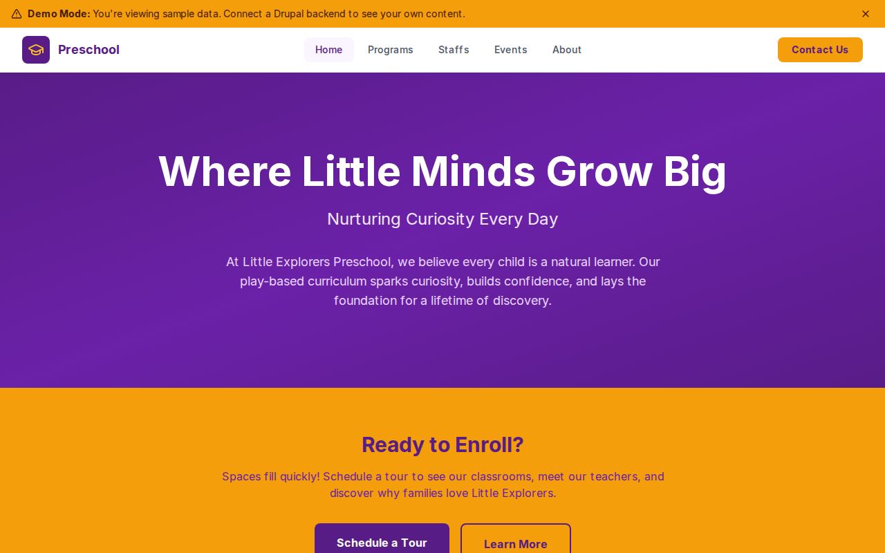

# Decoupled Preschool

A bright, welcoming website for preschools, daycare centers, and early childhood education programs. Built with Next.js and Drupal, it helps parents explore programs, meet staff, view upcoming events, and start the enrollment process -- all managed through a headless CMS.



[](https://vercel.com/new/clone?repository-url=https://github.com/nextagencyio/decoupled-preschool&project-name=my-preschool)

## Features

- **Programs** -- Showcase age-grouped learning programs (Toddler, Preschool, Pre-K, After School) with schedules, tuition, and age ranges
- **Staff Directory** -- Introduce teachers and administrators with photos, positions, certifications, and bios
- **Events Calendar** -- Promote open houses, family activities, art shows, and graduation ceremonies with dates and locations
- **Homepage with Hero & Features** -- Configurable landing page highlighting play-based learning, safety, nutrition, and family partnership
- **Contact & Enrollment** -- Dedicated pages for scheduling tours, submitting inquiries, and starting enrollment

## Quick Start

### 1. Clone the template

```bash
npx degit nextagencyio/decoupled-preschool my-preschool
cd my-preschool
npm install
```

### 2. Run interactive setup

```bash
npm run setup
```

This interactive script will:
- Authenticate with Decoupled.io (opens browser)
- Create a new Drupal space
- Wait for provisioning (~90 seconds)
- Configure your `.env.local` file
- Import sample content

### 3. Start development

```bash
npm run dev
```

Visit [http://localhost:3000](http://localhost:3000)

---

## Manual Setup

If you prefer to run each step manually:

<details>
<summary>Click to expand manual setup steps</summary>

### Authenticate with Decoupled.io

```bash
npx decoupled-cli@latest auth login
```

### Create a Drupal space

```bash
npx decoupled-cli@latest spaces create "My Preschool"
```

Note the space ID returned (e.g., `Space ID: 1234`). Wait ~90 seconds for provisioning.

### Configure environment

```bash
npx decoupled-cli@latest spaces env 1234 --write .env.local
```

### Import content

```bash
npm run setup-content
```

This imports the following sample content:

- **Homepage** -- "Little Explorers Preschool" with hero, 6 feature highlights (play-based learning, safety, teachers, meals, outdoor, family), and enrollment CTA
- **Program: Toddler Discovery** -- Ages 18 months-2 years, half-day, $1,200/month
- **Program: Preschool Adventures** -- Ages 3-4, full day, $1,450/month
- **Program: Pre-Kindergarten** -- Ages 4-5, extended day, $1,550/month
- **Program: After School Care** -- Ages 3-6, afternoons, $650/month
- **Staff: Maria Gonzalez** -- Lead Preschool Teacher, M.Ed. Early Childhood Education
- **Staff: James Chen** -- Pre-K Teacher, B.S. Child Development
- **Staff: Sarah Williams** -- Director, M.Ed. Educational Leadership
- **Event: Spring Open House** -- Campus tours and teacher meet-and-greet
- **Event: Little Artists Showcase** -- Annual student art exhibition
- **Event: Pre-K Graduation Ceremony** -- Cap-and-gown celebration
- **About** -- School history, philosophy, and commitment to inclusivity
- **Enrollment** -- Step-by-step enrollment process, tuition info, and required documents

</details>

## Content Types

### Homepage
Preschool landing page with configurable hero, feature highlights, and call-to-action.

| Field | Type | Description |
|-------|------|-------------|
| Hero Title | string | Main headline (e.g., "Where Little Minds Grow Big") |
| Hero Subtitle | string | Secondary tagline |
| Hero Description | text | Introductory paragraph |
| Features Title | string | Section heading for feature grid |
| Features Subtitle | string | Section subheading |
| Feature Items | paragraph[] | Icon + title + description blocks |
| CTA Title | string | Call-to-action heading |
| CTA Description | text | CTA body copy |
| Primary/Secondary CTA | string | Button labels |

### Program
Early learning programs for different age groups.

| Field | Type | Description |
|-------|------|-------------|
| Body | text | Full program description and activities |
| Age Range | string | Target age group (e.g., "3 - 4 years") |
| Schedule | string | Days and hours (e.g., "Mon-Fri, 8:00 AM - 3:00 PM") |
| Tuition | string | Monthly cost |
| Program Image | image | Photo representing the program |

### Staff Member
Teachers, aides, and administrative team.

| Field | Type | Description |
|-------|------|-------------|
| Body | text | Bio and teaching philosophy |
| Position | string | Job title (e.g., "Lead Preschool Teacher") |
| Email | string | Contact email |
| Photo | image | Staff headshot |
| Certifications | string | Professional credentials |

### Event
Open houses, family activities, and celebrations.

| Field | Type | Description |
|-------|------|-------------|
| Body | text | Event details and what to expect |
| Event Date | datetime | Date and time |
| Location | string | Venue or campus area |
| Event Image | image | Promotional image |

## Customization

### Colors & Branding
Edit `tailwind.config.js` to customize colors, fonts, and spacing. The default theme uses warm purples and amber accents to feel inviting and child-friendly.

### Content Structure
Modify `data/preschool-content.json` to change content types, fields, or sample data before importing.

### Components
React components are in `app/components/`. Key files:
- `HomepageRenderer.tsx` -- Landing page layout with hero, features, and CTA
- `ProgramCard.tsx` -- Program listing card with age range and schedule
- `StaffCard.tsx` -- Staff member card with photo and position
- `EventCard.tsx` -- Event listing card with date and location
- `Header.tsx` -- Navigation and site branding

## Demo Mode

Demo mode lets you preview the preschool site without connecting to a Drupal backend.

### Enable Demo Mode

```bash
NEXT_PUBLIC_DEMO_MODE=true
```

Or add to `.env.local`:
```
NEXT_PUBLIC_DEMO_MODE=true
```

### Removing Demo Mode

To switch to production with real CMS data:

1. Delete `lib/demo-mode.ts`
2. Delete `data/mock/` directory
3. Delete `app/components/DemoModeBanner.tsx`
4. Remove `DemoModeBanner` from `app/layout.tsx`
5. Remove demo mode checks from `app/api/graphql/route.ts`

## Deployment

### Vercel (Recommended)
[](https://vercel.com/new/clone?repository-url=https://github.com/nextagencyio/decoupled-preschool)

Set `NEXT_PUBLIC_DEMO_MODE=true` in Vercel environment variables for a demo deployment.

### Other Platforms
Works with any Node.js hosting platform that supports Next.js.

## Documentation

- [Decoupled.io Docs](https://www.decoupled.io/docs)
- [Next.js Documentation](https://nextjs.org/docs)
- [Drupal GraphQL](https://www.decoupled.io/docs/graphql)

## License

MIT
